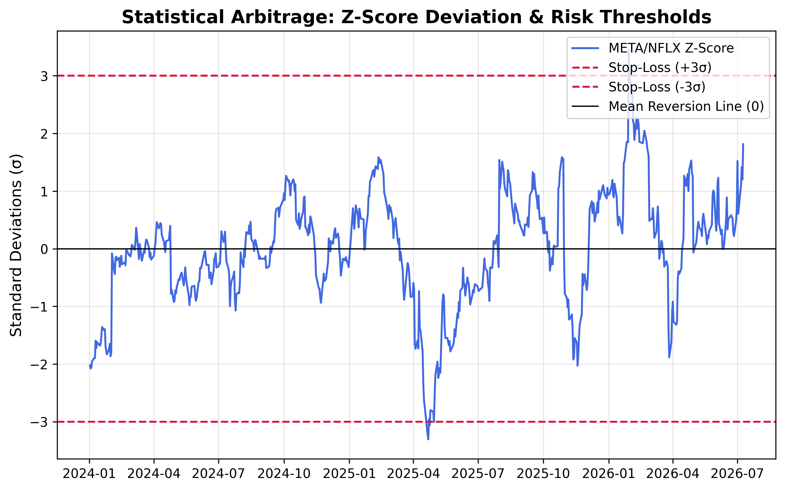

# StatArb-Engine: Statistical Arbitrage Framework

An automated quantitative pipeline designed to identify, backtest, and execute mean-reversion strategies in equity markets.

## Overview

This project explores the hypothesis that specific asset pairs (e.g., META & NFLX) exhibit cointegration—a statistical property where the spread between two assets is mean-reverting. The engine was built to test this hypothesis through Engle-Granger cointegration modeling and OLS regression.

## Pipeline Architecture

* **Screening Engine:** Scans a basket of equities for statistically significant cointegration using the Engle-Granger two-step method.
* **Backtesting Framework:** A "Truth Machine" that stress-tests strategies against 2 years of historical data, accounting for hedge ratios, Z-Score deviations, and stop-loss triggers.
* **Execution Engine:** A live-trading client connected to the Alpaca API, utilizing dollar-neutral weighting to minimize directional market exposure.

## Key Technical Specifications

* **Language:** Python 3.9
* **Quant Libraries:** statsmodels (OLS regression), pandas (time-series analysis), numpy (vectorized backtesting), matplotlib (visualization).
* **Execution:** RESTful API integration with Alpaca for paper trading.

## Analytical Findings

The backtesting phase revealed that the META/NFLX pair exhibited a negative Sharpe Ratio over the 2024–2026 observation period.

* **Key Learning:** The strategy successfully identified that the spread was trending rather than mean-reverting.
* **Risk Management:** The implementation of a hard stop-loss ($Z > 3$) prevented catastrophic capital drawdowns, demonstrating the critical importance of exit criteria in automated systems.

## Future Iterations

* **Volatility Filtering:** Integration of VIX-based filters to disable the engine during periods of macro-instability.
* **Multi-Factor Models:** Moving from simple pair trading to portfolio-based factor models.
